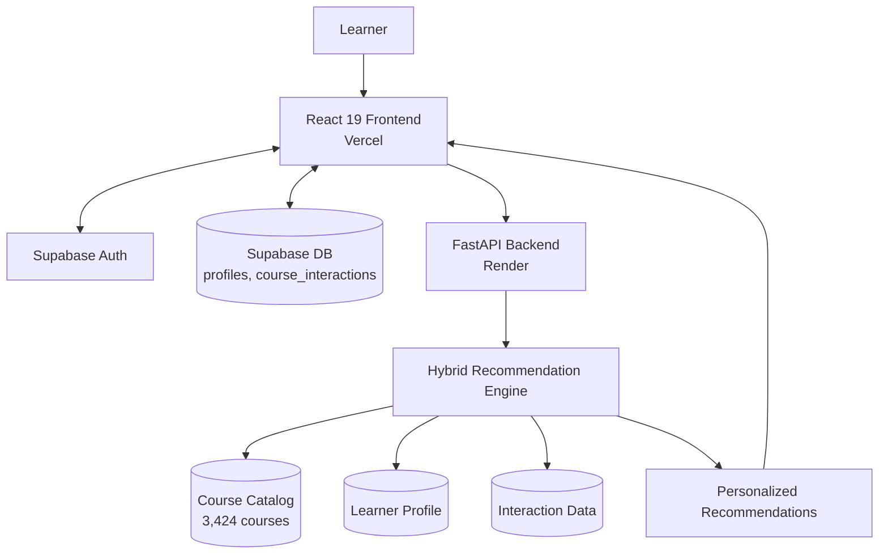
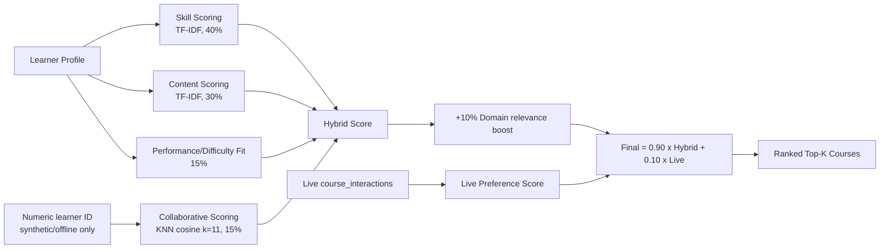
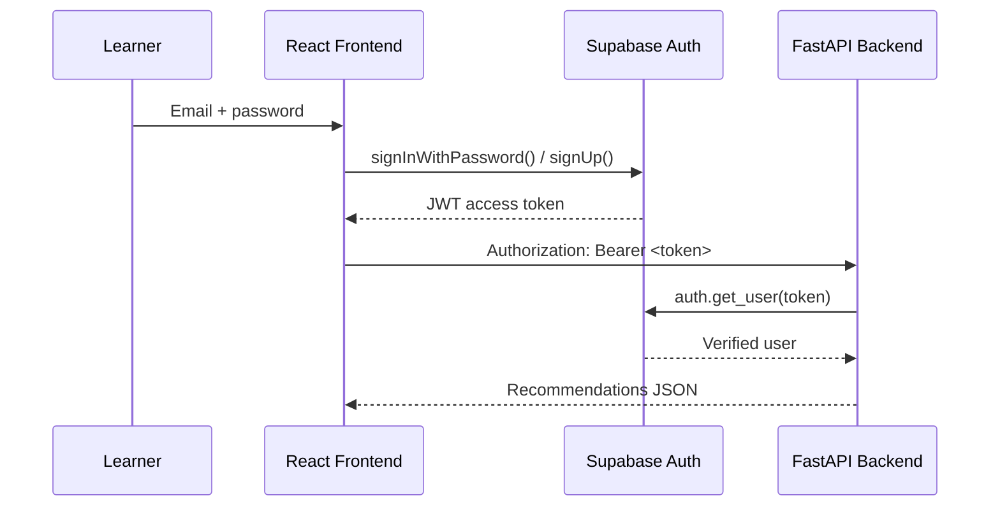

# LearnAI — AI Personalized Learning Recommendation System

**Hybrid machine learning course recommendations, served through a React + FastAPI + Supabase stack.**

[](https://ai-personalized-learning-recommenda.vercel.app/)
[](https://ai-personalized-learning-recommendation-k3t8.onrender.com/)
[](https://ai-personalized-learning-recommendation-k3t8.onrender.com/docs)
[]()

**Live demo:** https://ai-personalized-learning-recommenda.vercel.app/
**Backend API:** https://ai-personalized-learning-recommendation-k3t8.onrender.com/
**Swagger docs:** https://ai-personalized-learning-recommendation-k3t8.onrender.com/docs
**Repository:** https://github.com/ShaikhUzair7777/ai-personalized-learning-recommendation

---

## Screenshots

> _Add screenshots here:_
> - Landing page hero (`Learn smarter. Grow faster.`)

> - "How it works" 3-step section
> - Personalized dashboard (`Your learning path, intelligently built.`)
> - Recommendation cards with AI Match %, Skills/Content/Difficulty-Fit breakdown

---

## Problem

Generic course catalogs show every learner the same list, regardless of their skills, goal, or performance level — and never explain *why* a course was suggested.

## Solution

LearnAI scores a 3,424-course catalog against each learner's profile using four ML signals — **skill matching, content similarity, collaborative filtering, and performance/difficulty fit** — combined into one hybrid score, then explains each recommendation with a per-signal breakdown.

## Features

- Email/password auth (Supabase)
- Guided onboarding — learning goal, known skills, target skills, performance
- Personalized dashboard with a live recommendation count and profile summary
- Top-10 recommendations with **AI Match %** and Skill / Content / Difficulty-Fit bars
- **"Why recommended?"** explanation per course
- Save a course / start learning (both recorded as interactions that refine future recommendations)
- Profile update → recommendations regenerate

---

## Architecture



### Recommendation flow



> ⚠️ **Verified architectural note:** in production, real Supabase users are always scored with `user_id=None`, so the KNN collaborative component currently contributes **0** for live users — it is fully trained and evaluated offline (see [Evaluation](#evaluation)), but real personalization today comes from the skill/content scores plus the live-interaction blend. See the full documentation for details.

### Authentication flow



---

## ML Methodology

**Hybrid formula (locked, from `models/hybrid_config.joblib`):**

```
final_score = 0.90 * hybrid_score + 0.10 * live_preference_score

hybrid_score = 0.40 * skill_score
             + 0.30 * content_score
             + 0.15 * collaborative_score
             + 0.15 * performance_score
             + 0.10 * domain_relevance_boost
```

| Signal | Weight | Technique |
|---|---|---|
| Skill Matching | 40% | TF-IDF (course `skills` field) + cosine similarity; 0.70×target + 0.20×known + 0.10×goal |
| Content Relevance | 30% | TF-IDF (course title+description+skills, 10,000 features) + cosine similarity |
| Collaborative Signal | 15% | KNN, cosine metric, k=11 neighbors, over a synthetic 5,000×3,423 interaction matrix |
| Performance/Difficulty Fit | 15% | Rule-based 3×3 lookup: learner performance tier × course difficulty tier |

Full breakdown, exact formulas, and the production caveat on collaborative filtering are in the [companion documentation](#) (`.docx`).

---

## Dataset Summary

| Dataset | Source | Records | Real / Synthetic |
|---|---|---|---|
| Course catalog | Coursera course listings | 3,424 courses | Real |
| Learner features | OULAD (Open University Learning Analytics Dataset) | 28,785 learners | Real |
| Interactions (collaborative training/eval) | Generated by `notebooks/10b` | 5,000 users, 37,407 interactions | **Synthetic** |

---

## Tech Stack

**Frontend:** React 19, Vite 8, React Router 7, Axios, @supabase/supabase-js, lucide-react
**Backend:** FastAPI, Uvicorn, Pydantic, python-dotenv, supabase-py
**ML:** NumPy, pandas, scikit-learn (TF-IDF, KNN, cosine similarity), SciPy (sparse matrices), joblib
**Database/Auth:** Supabase (Postgres + Auth)
**Deployment:** Vercel (frontend), Render (backend), Supabase (managed DB/Auth)

---

## Evaluation

Offline evaluation (`notebooks/19_final_evaluation.py`) uses a **leave-one-out** split on the synthetic interaction set and compares four models at K=5/K=10 using **Precision@K, Recall@K, NDCG@K**:

| Model | Result (K=10) |
|---|---|
| Popularity baseline | Non-zero floor |
| Content-Based | Comparable to popularity |
| KNN Collaborative | Comparable to popularity; lowest NDCG@10 |
| **Hybrid** | **Highest Precision, Recall, NDCG@10** among the four |

> This is a **controlled, synthetic-data benchmark**, explicitly *not* real-world validation or production accuracy (stated directly in the evaluation notebook's own header comment). See the full documentation for interpretation caveats.

---

## Installation

```bash
git clone https://github.com/ShaikhUzair7777/ai-personalized-learning-recommendation.git
cd ai-personalized-learning-recommendation

# --- Backend ---
python -m venv venv
.\venv\Scripts\Activate.ps1        # Windows PowerShell
pip install -r requirements.txt
# create .env with SUPABASE_URL and SUPABASE_SERVICE_ROLE_KEY
uvicorn backend.main:app --reload --host 127.0.0.1 --port 8000

# --- Frontend ---
cd frontend-app
npm install
# create .env with VITE_SUPABASE_URL, VITE_SUPABASE_PUBLISHABLE_KEY, VITE_API_BASE_URL
npm run dev
```

Verify: `curl http://127.0.0.1:8000/api/health` or open `http://127.0.0.1:8000/docs`.

---

## Project Structure

```
backend/                 FastAPI app, auth, Supabase client, recommendation engine
frontend-app/src/        React pages, components, context, services, lib
data/processed/          Cleaned datasets + evaluation plots
models/                  9 trained artifacts (TF-IDF, KNN, hybrid config)
notebooks/                01-21: full offline data + ML pipeline
```

---

## Future Scope

- Video recommendations alongside courses (e.g. relevant YouTube links per topic)
- Standalone study-material recommendations
- Expanding beyond the current generic profile to explicit tracks for every learner stage — primary school through university, including 12th-grade/pre-university students
- Feeding real `course_interactions` into the KNN model so collaborative filtering is active for live users
- Adaptive learning paths, knowledge-graph skill relationships, deep-learning recommenders, reinforcement-learning re-ranking, a mobile app

## Limitations

- Collaborative filtering is trained and evaluated, but not yet wired to real users in production
- Interaction data used for training/evaluation is synthetic, not collected from real learners
- Fixed hybrid weights (not learned/tuned)
- No automated test suite yet

---

## Author

Shaikh Uzair — [GitHub](https://github.com/ShaikhUzair7777)

## Project Links

- **Live app:** https://ai-personalized-learning-recommenda.vercel.app/
- **API:** https://ai-personalized-learning-recommendation-k3t8.onrender.com/
- **Swagger:** https://ai-personalized-learning-recommendation-k3t8.onrender.com/docs
- **Repo:** https://github.com/ShaikhUzair7777/ai-personalized-learning-recommendation
